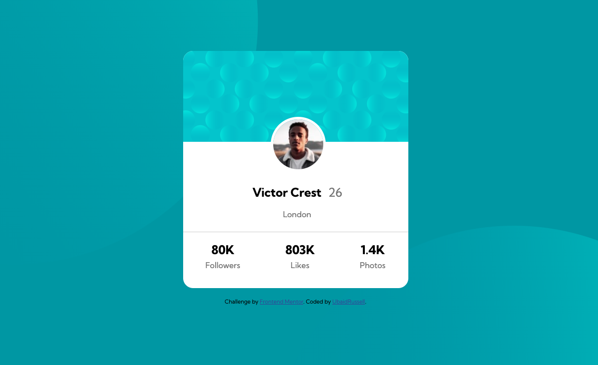

# Frontend Mentor - Profile card component solution

My solution to the [Profile card component challenge on Frontend Mentor](https://www.frontendmentor.io/challenges/profile-card-component-cfArpWshJ). Frontend Mentor challenges help you improve your coding skills by building realistic projects. 

## Table of contents

- [Overview](#overview)
  - [The challenge](#the-challenge)
  - [Screenshot](#screenshot)
  - [Links](#links)
- [My process](#my-process)
  - [Built with](#built-with)
  - [What I learned](#what-i-learned)
  - [Continued development](#continued-development)
  - [Useful resources](#useful-resources)
- [Author](#author)
- [Acknowledgments](#acknowledgments)

## Overview
    Victor Crest from London Profile card component made with HTML and CSS displaying follower count, total likes and total photos
### The challenge

- Build out the project to the designs provided

### Screenshot



### Links 

- Solution URL: [Add solution URL here](https://github.com/UbaidRussell/Profile-card-component)
- Live Site URL: [Add live site URL here](https://ubaidrussell.com/Profile-card-component/)

## My process
    Mapped out the site and executed.

### Built with

- Semantic HTML5 markup
- CSS custom properties
- Flexbox

### What I learned

For the CSS we had to fade the background blots into the background and rotate them to align them up right. I learned how to do that with the following code:

```css
.blot-1{
    z-index: -1;
    position: absolute;
    rotate: 100deg;
    top: -400px;
    left: -100px;
}
.blot-2{
    z-index: -1;
    position: absolute;
    left: 900px;
    top: 500px;
    rotate: -320deg;
}

```

### Continued development

### Useful resources

- [Example resource 1](https://www.w3schools.com/cssref/pr_background-image.php) - We didn't have to do much research for this project but this helped me understand how to use background images in CSS.

## Author

- Website - [UbaidRussell.com](http://ubaidrussell.com/)
- Frontend Mentor - [@UbaidRussell](https://www.frontendmentor.io/profile/UbaidRussell)
- Twitter - [@UbaidRussell](https://www.twitter.com/ubaidrussell)


## Acknowledgments
Shoutout to the guys at Frontend Mentor for making this project and helping me learn more about frontend development.